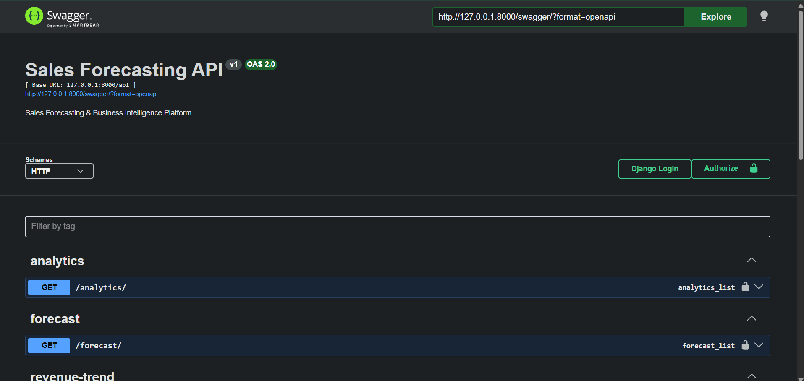
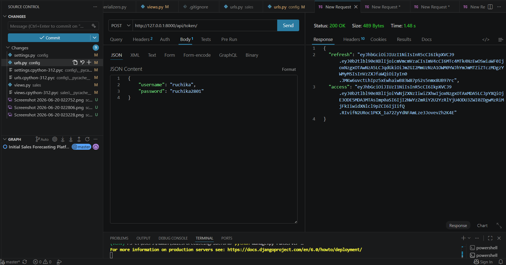
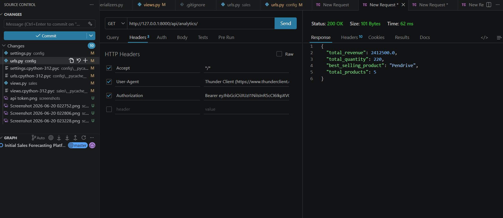
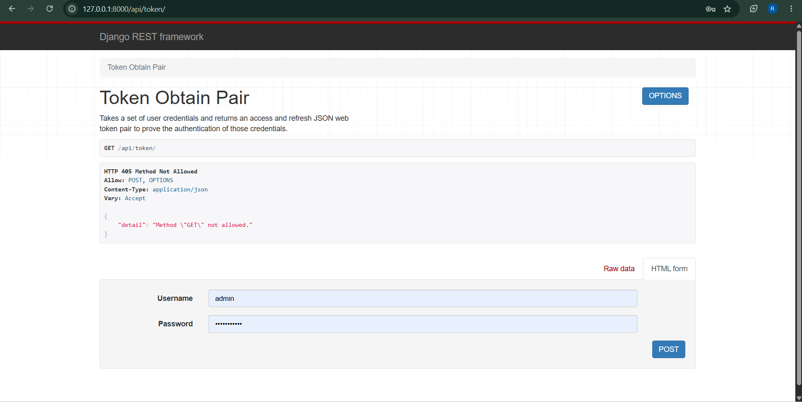

# Sales Forecasting & Business Intelligence Platform

## Overview

A Django REST Framework based Sales Forecasting and Business Intelligence Platform that enables organizations to ingest sales data, perform business analytics, and generate future revenue forecasts using Machine Learning models.

The platform provides secure JWT authentication, REST APIs, sales analytics, revenue trend monitoring, CSV-based bulk data upload, and forecasting using Prophet and XGBoost.

---

# Sales Forecasting & Business Intelligence Platform

## Project Overview

A secure Django REST Framework-based Business Intelligence and Sales Forecasting platform designed to help organizations manage sales data, analyze business performance, and generate future revenue predictions using Machine Learning.

The platform supports JWT Authentication, CSV-based data ingestion, analytics APIs, revenue trend monitoring, and forecasting using Prophet and XGBoost models.

---

## Key Features

### Authentication & Security

* JWT Authentication using SimpleJWT
* Protected API endpoints
* Token-based access control

### Sales Management

* Create sales records
* View sales records
* Update sales records
* Delete sales records
* Automatic revenue calculation

### CSV Data Ingestion

* Bulk upload sales records through CSV files
* Automated data validation and storage
* Revenue generation during upload

### Business Analytics

* Total Revenue Analysis
* Total Quantity Sold
* Best Selling Product Identification
* Product Performance Tracking

### Revenue Trend Monitoring

* Historical sales trend analysis
* Revenue tracking over time
* Time-series business insights

### Machine Learning Forecasting

#### Prophet Forecasting

* Future revenue prediction
* Trend forecasting
* Time-series analysis

#### XGBoost Forecasting

* Machine learning-based forecasting
* Predictive revenue estimation
* Business planning support

### API Documentation

* Swagger UI
* ReDoc Documentation
* Interactive API Testing

---

## Tech Stack

### Backend

* Python
* Django
* Django REST Framework

### Authentication

* JWT (SimpleJWT)

### Database

* SQLite

### Data Processing

* Pandas
* NumPy

### Machine Learning

* Prophet
* XGBoost
* Scikit-Learn

### Documentation

* drf-yasg (Swagger)

---

## Architecture

CSV Upload
↓
Django REST APIs
↓
SQLite Database
↓
Analytics Engine
↓
Forecasting Models
↓
Business Intelligence Insights

---

## API Endpoints

### Authentication

POST /api/token/

POST /api/token/refresh/

### Sales Management

GET /api/sales/

POST /api/sales/

GET /api/sales/{id}/

PUT /api/sales/{id}/

DELETE /api/sales/{id}/

### Analytics

GET /api/analytics/

GET /api/revenue-trend/

### Forecasting

GET /api/forecast/

GET /api/xgboost-forecast/

### CSV Upload

POST /api/upload-csv/

### Documentation

GET /swagger/

GET /redoc/

---

## Screenshots

### Swagger Documentation

### JWT Authentication

### Analytics API

### JWT Token

---

## Business Value

This platform enables organizations to:

* Monitor sales performance in real time
* Identify high-performing products
* Analyze revenue trends
* Forecast future sales
* Support data-driven business decisions
* Improve strategic planning through predictive analytics

---

## Future Enhancements

* PostgreSQL Integration
* AWS Deployment
* Docker Containerization
* Power BI Dashboard Integration
* Role-Based Access Control (RBAC)
* Automated Reporting

---

## Author

Ruchika Navrange

LinkedIn:
https://www.linkedin.com/in/ruchika-navrange-935a04257
